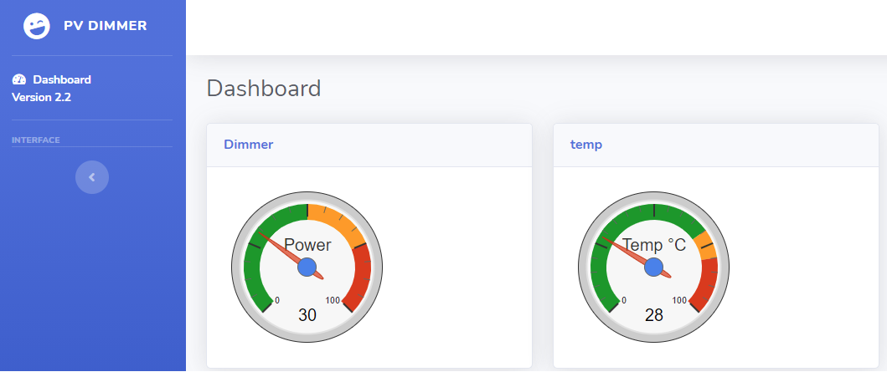

# # Distant dimmer for discharge PV surplus 

I remaster the distant dimmer with the new ALL in dimmer from Robotdyn ( and support 8A !! ) 

## Installation

make a git clone of the project and use Visual Studio Code for build and upload to the board. 

### for the dimmer with AC and Wemos on board 
by default, D0 and D1 is used and solt on the board. 
D2 can be used by a Dallas 18b20, I explaint after how to make the small board

### for StandAlone Boards 
D5 D6 and D7 is configured (configured for a lolin NodeMCU) 

On Visual Studio upload firmware AND filesystem. 

 

###  First Start

at the first start, the wemos use the Wifimanager for configure the Wifi. 
It create a new Wifi AP 'dimmer', connect on it at 192.168.4.1 and configure your Wifi

```mermaid
sequenceDiagram
Start -->> New Wifi : 
New Wifi -->> Configure: 192.198.4.1
Configure -->> Start : wifi configured 
Start  -->> Run : Open Website and Dim
```

### Update

You can update your firmware directly by the url /update 
it's open OTA web page, and you can push the firmware or filesystem. 

for generating firmware, on Visualstudio/ plateform IO, use the build option 
the build firmware is stored at .pio\build\d1_mini\firmware.elf folder 

## CHANGE POWER ( for control )
You can control the power by an HTTP request : 

Control :  http://IP/?POWER=xx
the max power limit is configured on the config.html page 

```mermaid
sequenceDiagram
Website -->> Dimmer : ?POWER=x
Dimmer -->> Website : Apply
```
you can send the command by you domotic server or your pv router 

### Use with Pv router 

You can control directly the dimmer with this PV router code 
https://github.com/xlyric/pv-router-esp32

It use this pv routeur,  

 
The board was sold by a French Association ( APPER ) and a TTGO Tdisplay, A SCT013-30 and AC12 power supply need to be bought separatly 
The board is open source and freely for non commercial usage. 

### Chaine dimmer
You can now chaine multiple dimmers
2 options : 
equal : send the same command to the other dimmer
delest (surplus) : send command to the other dimmer when the maximum power is reached on the first dimmer. 

### Dallas probe
You can use dallas 18b20 Probe for limit the temperature of your water tank
the limit temp configuration is on /config.html page. 

### MQTT configuration
if you need a password for connect to your mosquitto (MQTT) serveur, the information of connection is in the file config.h 

## Note on Robotdyn librairie
with actual version of arduino GUI or VS, the librairie not working ( memory problem ) 
I modify the librairie and is called in the lib_deps variable
lib_deps = https://github.com/xlyric/RBDDimmer

and called by plateformio.ini file

## Create the Dallas board

on a test plate, solder the long female pin from your Wemos D1 mini 

 

( I cut the 3rd pin ( RX ) I use the place for GND connector ) 

solder a 5.6kOhms resistance between 3.3V hole ( first hole ) 
and D2 ( last hole ) 
and sold 3.3V - GND and D2 to your Dallas 18b20 
or add connector 

 

you can now connect the board to the main board 

### Print Dallas board
A printed Board look like this 

